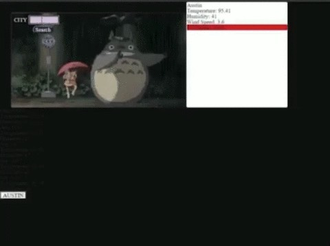

<body style="background-color: black;">

# **Work Day Planner** 

## Check out the deployed app <a href="https://desmondaldridge.github.io/weather-dashboard/">here!</a>

## <u>FEATURES</u>

#### A weather that provides current weather conditions for particular cities, searched by the client.

#### The app also provides the 5 day forecast for the searched city.

#### Individual buttons are produced for each city previously searched, of which - if clicked - will return to that particular city's weather info and forecast.

## <u>BEHIND THE SCENES</u>

#### INCOMPLETE: With this assignment I tackled raw functionality first, and then began styling after the fact. Unfortunately, I ran out of time, and my app is currently incomplete. I also neglected the weather condition icons. Not because I consider that to be "styling" necessarily (they're parsed and displayed from the object), but because I forgot that aspect of the display at the moment of tackling the code that would provide the forecast data. I intend to include those as well.

## <u>REFLECTIONS</u>

#### I understand why this assignment overlapped with the project, as all homework has thus far overlapped with the following week's lessons thus far. And I realize too that that is by design for this program as meta-training for multi-tasking and prioritizing focus (etc.) in our professional lives as coders. However, for the first project specifically, since there is so much "finding our feet" involved in simply organizing and allotting tasks (and overall working collaboratively), having a previous week's assignment overlap with the very first project might be an aspect of the curriculum to reconsider. But I'm no education profession, so take that "suggestion" with a grain of salt.